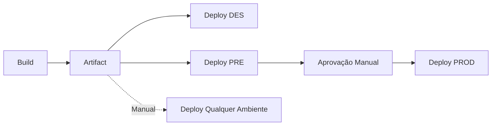

# GitHub Actions - Build e Deploy Multi-Ambiente

Este repositório contém exemplos de GitHub Actions para build e deploy separados em múltiplos ambientes.

## 📋 Estrutura dos Workflows

### 1. `build-and-deploy.yml`
Workflow principal que executa build e deploy automaticamente baseado na branch:

- **Build**: Cria o artefato uma única vez
- **Deploy DES**: Quando push em `develop`
- **Deploy PRE**: Quando push em `main`
- **Deploy PROD**: Após deploy em PRE (com aprovação manual)

### 2. `deploy-existing-build.yml`
Workflow manual para fazer deploy de um build existente em qualquer ambiente:

- Permite selecionar a versão do build
- Permite escolher o ambiente (DES, PRE ou PROD)
- Reutiliza artefatos já gerados

## 🚀 Como Usar

### Deploy Automático
```bash
# Deploy para DES
git push origin develop

# Deploy para PRE e PROD
git push origin main
```

### Deploy Manual
1. Vá para **Actions** no GitHub
2. Selecione **Deploy Existing Build**
3. Clique em **Run workflow**
4. Escolha a versão e o ambiente
5. Clique em **Run workflow**

## ⚙️ Configuração Necessária

### 1. Configurar Environments no GitHub
Vá em **Settings > Environments** e crie:

#### Environment: DES
- **Variables**:
  - `DES_URL`: URL do ambiente de desenvolvimento
- **Secrets**:
  - `DES_API_KEY`: Chave de API para DES

#### Environment: PRE
- **Variables**:
  - `PRE_URL`: URL do ambiente de pré-produção
- **Secrets**:
  - `PRE_API_KEY`: Chave de API para PRE
- **Protection Rules**:
  - ✅ Required reviewers: 1 pessoa

#### Environment: PROD
- **Variables**:
  - `PROD_URL`: URL do ambiente de produção
- **Secrets**:
  - `PROD_API_KEY`: Chave de API para PROD
- **Protection Rules**:
  - ✅ Required reviewers: 2 pessoas
  - ✅ Wait timer: 5 minutos

### 2. Estrutura do Projeto
Certifique-se de ter os seguintes arquivos/scripts:

```json
// package.json
{
  "scripts": {
    "build": "seu-comando-de-build",
    "test": "seu-comando-de-test"
  }
}
```

## 🔄 Fluxo de Deploy



## 📊 Vantagens desta Abordagem

1. ✅ **Mesmo Build**: O mesmo artefato é deployado em todos os ambientes
2. ✅ **Rastreabilidade**: Cada build tem uma versão única
3. ✅ **Segurança**: Aprovações manuais para ambientes críticos
4. ✅ **Flexibilidade**: Deploy manual de qualquer versão
5. ✅ **Eficiência**: Build executado apenas uma vez

## 🔐 Segurança

- Secrets diferentes para cada ambiente
- Aprovações obrigatórias para PRE e PROD
- Environments protegidos com branch restrictions
- Artifacts com retenção de 30 dias

## 📝 Exemplos de Comandos de Deploy

### AWS S3
```bash
aws s3 sync dist/ s3://bucket-name --delete
```

### Kubernetes
```bash
kubectl set image deployment/app app=myimage:$VERSION -n $NAMESPACE
```

### Docker
```bash
docker build -t myapp:$VERSION .
docker push myapp:$VERSION
```

### SSH/SCP
```bash
scp -r dist/* user@server:/var/www/app/
ssh user@server 'systemctl restart app'
```

## 🐛 Troubleshooting

### Artifact não encontrado
- Verifique se o nome do artifact está correto
- Confirme que o artifact ainda existe (retenção de 30 dias)

### Deploy falhou
- Verifique os logs do workflow
- Confirme que as secrets estão configuradas
- Teste os comandos de deploy manualmente

### Aprovação pendente
- Vá em **Actions > Workflow Run > Review deployments**
- Selecione o ambiente e aprove
