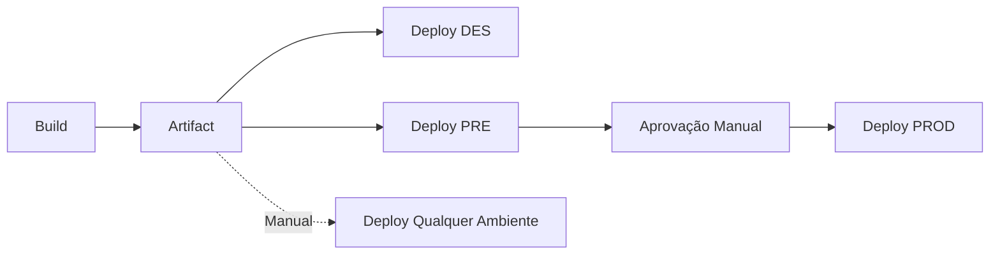

# GitHub Actions - Build e Deploy Multi-Ambiente

Este repositório contém exemplos de GitHub Actions para build e deploy **totalmente separados** em múltiplos ambientes.

## 📋 Estrutura dos Workflows

### 1. `build.yml` - Workflow de Build
Workflow responsável **apenas** por gerar o build:

- Cria um arquivo `build-info.txt` com informações do build
- Gera versionamento automático (v1.0.X)
- Faz upload do artifact para uso posterior
- Triggado automaticamente em push para `main` ou `develop`
- Pode ser executado manualmente

### 2. `deploy.yml` - Workflow de Deploy
Workflow responsável **apenas** por fazer deploy:

- **Modo Automático**: Triggado quando o workflow de Build completa
- **Modo Manual**: Permite escolher versão e ambiente específico
- Faz download do artifact gerado pelo Build
- Imprime o conteúdo do arquivo + nome do ambiente
- **Deploy DES**: Quando build vem de `develop`
- **Deploy PRE e PROD**: Quando build vem de `main`

### 3. Outros Workflows (Exemplos Alternativos)
- `build-and-deploy.yml` - Pipeline completo em um único workflow
- `deploy-existing-build.yml` - Deploy manual de builds existentes
- `pipeline-with-reusable.yml` - Pipeline usando workflow reutilizável
- `reusable-deploy.yml` - Workflow de deploy reutilizável

## 🚀 Como Usar

### Build + Deploy Automático

```bash
# Push para develop → Build → Deploy DES
git push origin develop

# Push para main → Build → Deploy PRE e PROD
git push origin main
```

O workflow de Deploy é automaticamente triggado quando o Build completa com sucesso!

### Build Manual
1. Vá para **Actions** no GitHub
2. Selecione **Build**
3. Clique em **Run workflow**
4. Escolha a branch
5. O deploy será automático após o build

### Deploy Manual de Build Existente
1. Vá para **Actions** no GitHub
2. Selecione **Deploy**
3. Clique em **Run workflow**
4. Informe a versão do build (ex: `v1.0.123`)
5. Escolha o ambiente (ou deixe vazio para todos)
6. Clique em **Run workflow**

## ⚙️ Configuração Necessária

### 1. Configurar Permissões no GitHub
Vá em **Settings > Actions > General** e configure:

- **Workflow permissions**: "Read and write permissions"
- ✅ Marque "Allow GitHub Actions to create and approve pull requests"

Isso permite que o workflow de Deploy baixe artifacts do workflow de Build.

### 2. Configurar Environments no GitHub
Vá em **Settings > Environments** e crie:

#### Environment: DES
- **Variables**:
  - `DES_URL`: URL do ambiente de desenvolvimento
- **Secrets**:
  - `DES_API_KEY`: Chave de API para DES

#### Environment: PRE
- **Variables**:
  - `PRE_URL`: URL do ambiente de pré-produção
- **Secrets**:
  - `PRE_API_KEY`: Chave de API para PRE
- **Protection Rules**:
  - ✅ Required reviewers: 1 pessoa (opcional)

#### Environment: PROD
- **Variables**:
  - `PROD_URL`: URL do ambiente de produção
- **Secrets**:
  - `PROD_API_KEY`: Chave de API para PROD
- **Protection Rules**:
  - ✅ Required reviewers: 2 pessoas (recomendado)
  - ✅ Wait timer: 5 minutos (opcional)

### 3. Exemplo do Build e Deploy

O exemplo atual é bem simples:

**Build (build.yml):**
- Gera um arquivo `build-info.txt` com informações do build
- Conteúdo: "Gerado o build v1.0.X para o ambiente"

**Deploy (deploy.yml):**
- Faz download do artifact
- Imprime o conteúdo do arquivo `build-info.txt`
- Imprime o nome do ambiente (DES, PRE ou PROD)

### 4. Estrutura do Projeto (Opcional)
Para projetos reais, adicione os scripts necessários:

```json
### Workflow Separado (build.yml + deploy.yml)

```
Push → Build Workflow
         ↓
      [Artifact]
         ↓
      Deploy Workflow (auto-trigger)
         ↓
    ┌────┴────┐
    ↓         ↓
  DES      PRE → PROD
(develop)   (main)
```

**Branch develop:**
1. Build gera artifact
2. Deploy automático em DES

**Branch main:**
1. Build gera artifact
2. Deploy automático em PRE
3. Deploy automático em PROD (após PRE)
Separação de Responsabilidades**: Build e Deploy em workflows diferentes
2. ✅ **Mesmo Build**: O mesmo artefato é deployado em todos os ambientes
3. ✅ **Rastreabilidade**: Cada build tem uma versão única
4. ✅ **Segurança**: Aprovações manuais para ambientes críticos (configurável)
5. ✅ **Flexibilidade**: Deploy manual de qualquer versão em qualquer ambiente
6. ✅ **Eficiência**: Build executado apenas uma vez
7. ✅ **Re-deploy**: Fácil fazer re-deploy de versões anteriores
8. ✅ **Independência**: Deploy pode rodar sem precisar fazer novo build



## 📊 Vantagens desta Abordagem

1. ✅ **Mesmo Build**: O mesmo artefato é deployado em todos os ambientes
2. ✅ **Rastreabilidade**: Cada build tem uma versão única
3. ✅ **Segurança**: Aprovações manuais para ambientes críticos
4. ✅ **Flexibilidade**: Deploy manual de qualquer versão
5. ✅ **Eficiência**: Build executado apenas uma vez

## 🔐 Segurança

- Secrets diferentes para cada ambiente
- Aprovações obrigatórias para PRE e PROD
- Environments protegidos com branch restrictions
- Artifacts com retenção de 30 dias

## 📝 Exemplos de Comandos de Deploy

### AWS S3
```bash
aws s3 sync dist/ s3://bucket-name --delete
```

### Kubernetes
```bash
kubectl set image deployment/app app=myimage:$VERSION -n $NAMESPACE
```

### Docker
```bash
docker build -t myapp:$VERSION .
docker push myapp:$VERSION
```

### SSH/SCP
```bash
scp -r dist/* user@server:/var/www/app/
ssh user@server 'systemctl restart app'
```

## 🐛 Troubleshooting

### Artifact não encontrado
- Verifique se o nome do artifact está correto
- Confirme que o artifact ainda existe (retenção de 30 dias)

### Deploy falhou
- Verifique os logs do workflow
- Confirme que as secrets estão configuradas
- Teste os comandos de deploy manualmente

### Aprovação pendente
- Vá em **Actions > Workflow Run > Review deployments**
- Selecione o ambiente e aprove
